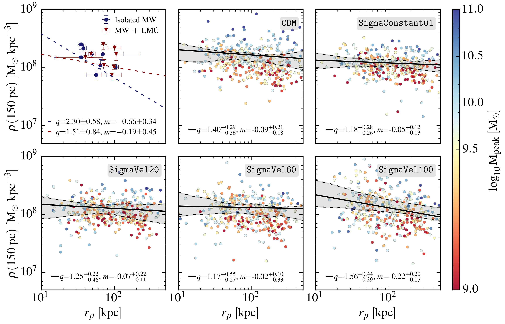

# TangoSIDM: the evolution of satellite halos

Code and data repository for [Anau Montel and Correa (2024)](https://arxiv.org/abs/2401.xxxxx).

[](https://opensource.org/licenses/MIT)
[](https://arxiv.org/abs/2401.xxxxx)



## Note
The repository contains:
- [TangoSIDM data](https://github.com/NoemiAM/TangoSIDM_satellites/tree/main/data/TangoSIDM) regarding Milky-Way type halos and their satellites in the TangoSIDM simulations suite. The large `.hdf5` files in [`data/TangoSIDM/`](https://github.com/NoemiAM/TangoSIDM_satellites/tree/main/data/TangoSIDM) are stored via [Git Large File Storage](https://git-lfs.com). More information can be found in [`data/TangoSIDM/README.md`](https://github.com/NoemiAM/TangoSIDM_satellites/blob/main/data/TangoSIDM/README.md).
- [Gaia data](https://github.com/NoemiAM/TangoSIDM_satellites/tree/main/data/Gaia) for the Milky Way dwarf-spheroidal galaxies. More information can be found in [`data/Gaia/README.md`](https://github.com/NoemiAM/TangoSIDM_satellites/blob/main/data/Gaia/README.md).
- [examples](https://github.com/NoemiAM/TangoSIDM_satellites/tree/main/examples) notebook to explore [TangoSIDM data](https://github.com/NoemiAM/TangoSIDM_satellites/tree/main/data/TangoSIDM) and reproduce the main results of the work. 

## Citation

If you use this code and the data in your analysis, please use the following citations:

```
@article{anaumontel2024,
  title={TangoSIDM: the evolution of satellite halos},
  author={Anau Montel, Noemi and Correa, Camila},
  journal={arXiv preprint arXiv:2401.xxxxx},
  year={2024}
}
```
and 

```
@article{Correa_2022,
   title={TangoSIDM: tantalizing models of self-interacting dark matter},
   volume={517},
   ISSN={1365-2966},
   url={http://dx.doi.org/10.1093/mnras/stac2830},
   DOI={10.1093/mnras/stac2830},
   number={2},
   journal={Monthly Notices of the Royal Astronomical Society},
   publisher={Oxford University Press (OUP)},
   author={Correa, Camila A and Schaller, Matthieu and Ploeckinger, Sylvia and Anau Montel, Noemi and Weniger, Christoph and Ando, Shin’ichiro},
   year={2022},
   month=oct, pages={3045–3063} }
```

If you use the data available in the [`data/Gaia/`](https://github.com/NoemiAM/TangoSIDM_satellites/tree/main/data/Gaia) folder, please make sure to cite the correct source as indicated in the [`data/Gaia/README.md`](https://github.com/NoemiAM/TangoSIDM_satellites/blob/main/data/Gaia/README.md) file.